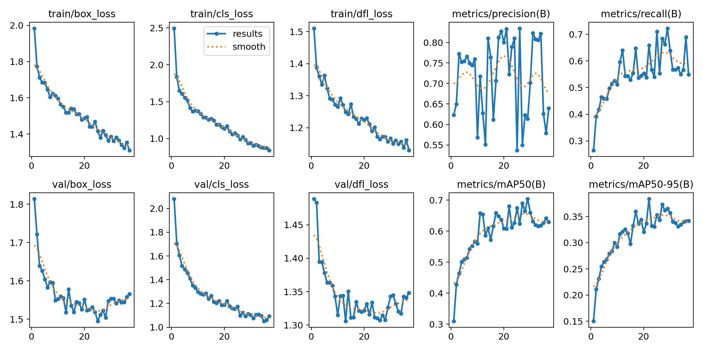
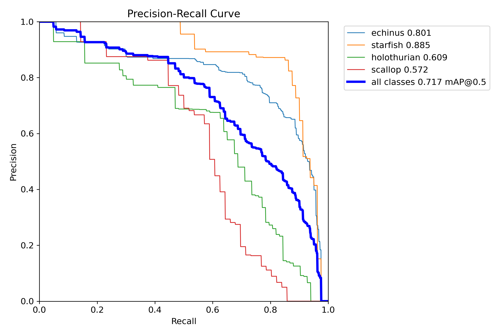
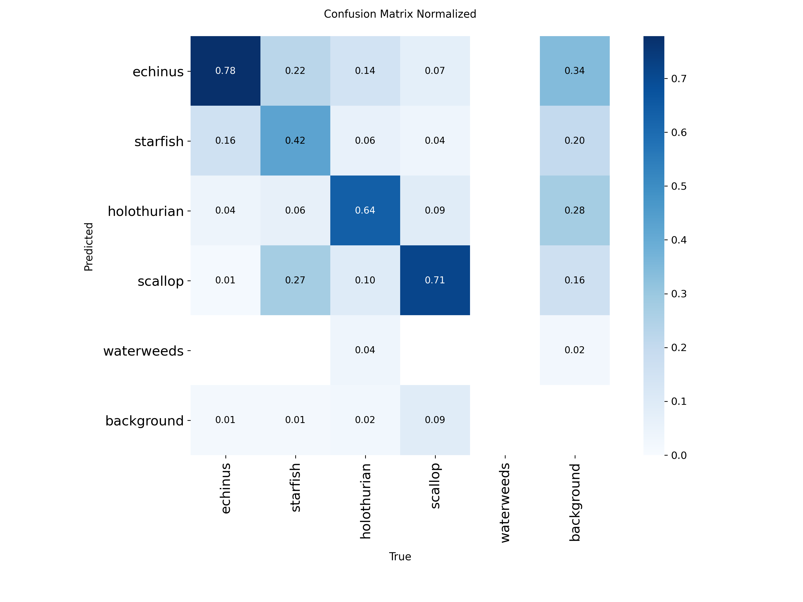

# Underwater Object Detection with YOLOv9

Fine-tuned **YOLOv9c** for marine object detection on the URPC 2019 underwater dataset using Ultralytics.

**Kaggle notebook:** https://www.kaggle.com/code/salonichippa/underwater-yolo-v2  
**Dataset (corrected labels):** https://www.kaggle.com/datasets/salonichippa/urpc2019-640-15pct-v2  
**Live demo:** Streamlit Cloud (after deploy) — or run locally with `streamlit run streamlit_app.py` / `python app.py` (Gradio).

## Results (test set, corrected class IDs)

| Model | mAP@0.5 | mAP@0.5:0.95 | Precision | Recall |
|-------|---------|--------------|-----------|----------|
| **YOLOv9c** | **71.67%** | 39.18% | 71.50% | 71.51% |
| YOLO11s (baseline) | 63.57% | 32.23% | 71.59% | 56.62% |

**Per-class (YOLOv9c mAP@0.5):** echinus 80.1% · starfish 88.5% · holothurian 60.9% · scallop 57.2%

**Dataset:** 15% stratified subset of URPC 2019 at 640×640 (Kaggle: `urpc2019-640-15pct-v2`)  
**Classes:** echinus, starfish, holothurian, scallop, waterweeds

See [results/RESULTS.md](results/RESULTS.md) for full tables and label-fix notes.

### Visualizations

| Training metrics (all epochs) | Precision–Recall curve |
|---|---|
|  |  |

| Confusion matrix (normalized) |
|---|
|  |

## Project highlights

- Built preprocessing pipeline (`prepare_urpc640.py`) — letterbox resize, **1→0 class-ID fix**, stratified sampling
- Compared **YOLOv9c vs YOLO11s** on the same corrected subset (v9c **+8.1 pts** test mAP)
- End-to-end workflow: preprocess locally → train on Kaggle GPU → evaluate → Streamlit / Gradio demo

## Repository structure

```
├── streamlit_app.py            # Streamlit Cloud demo (interviewer link)
├── app.py                      # Local Gradio demo
├── prepare_urpc640.py          # Create 640×640 YOLO dataset from URPC 2019
├── packages.txt                # System libs for Streamlit Cloud
├── requirements.txt            # Used by Streamlit Cloud automatically
├── requirements-streamlit.txt  # Same deps (optional local alias)
├── notebooks/
│   └── underwater-yolo-v2.ipynb
├── examples/
├── results/
├── assets/
└── weights/                    # best.pt locally (gitignored); Cloud downloads from Release
```

## Quick start

### 0. Live demo (Streamlit — recommended for interviews)

**Local**

```bash
pip install -r requirements.txt
# weights/yolov9c_urpc640_15pct_best.pt (or *_v2.pt) must exist, OR set WEIGHTS_URL
streamlit run streamlit_app.py
```

**Streamlit Community Cloud**

1. GitHub **Release** `v1.0` with `yolov9c_urpc640_15pct_best_v2.pt` (already done)
2. Push this repo to GitHub
3. Go to [share.streamlit.io](https://share.streamlit.io) → **New app**
4. Repo: `salonic06/Underwater-Object-Detection` · Branch: `main` · Main file: `streamlit_app.py`
5. Deploy (Cloud auto-reads root `requirements.txt` + `packages.txt` — no Advanced settings)
6. Open the `*.streamlit.app` URL (warm it once before interviews)

### 0b. Local Gradio

```bash
pip install -r requirements-deploy.txt
python app.py
```

Open `http://127.0.0.1:7860`. Default confidence **0.50**.

### 1. Preprocess dataset (local)

```bash
pip install -r requirements-preprocess.txt
python prepare_urpc640.py --fraction 0.15 --output ./data/urpc2019-640-15pct-v2 --clean
```

Upload to Kaggle as `urpc2019-640-15pct-v2`.

### 2. Train on Kaggle

1. Open the [Kaggle notebook](https://www.kaggle.com/code/salonichippa/underwater-yolo-v2)
2. Attach dataset **`urpc2019-640-15pct-v2`**
3. Enable **GPU T4**, Internet **On**
4. Confirm class counts show **echinus > 0**, then Run all

## Method

| Component | Choice |
|-----------|--------|
| Model | YOLOv9c (Ultralytics) |
| Input size | 640×640 (letterbox) |
| Optimizer | AdamW + cosine LR |
| Augmentation | HSV (underwater color), mixup, copy-paste |
| Hardware | Tesla T4 GPU (Kaggle) |

## Limitations

- Trained on 15% of URPC 2019 (~705 images), not the full benchmark
- Scallop / holothurian remain harder; waterweeds rare in this split
- Not SOTA vs papers using full URPC + custom architectures (~81%+ mAP)

## References

- URPC 2019: Underwater Robot Picking Contest dataset
- [Ultralytics YOLO](https://github.com/ultralytics/ultralytics)
- YOLOv9: [arxiv.org/abs/2402.13616](https://arxiv.org/abs/2402.13616)

## Author

Saloni Chippa — B.Tech research project, IIITP
